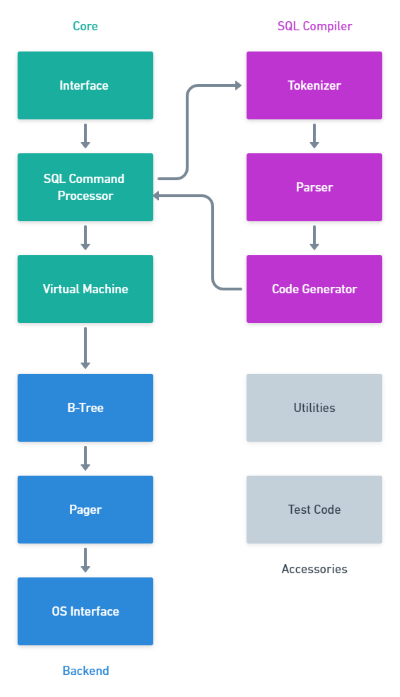

Rust-SQLite (SQLRite)
===
[](https://github.com/joaoh82/rust_sqlite/actions)
[](https://deps.rs/repo/github/joaoh82/rust_sqlite)
[](https://coveralls.io/github/joaoh82/rust_sqlite?branch=main)
[](https://deps.rs/repo/github/joaoh82/rust_sqlite)
[](./LICENSE)

`Rust-SQLite`, aka `SQLRite` , is a simple embedded database modeled off `SQLite`, but developed with `Rust`. The goal is get a better understanding of database internals by building one.

> What I cannot create, I do not understand. 
> — Richard Feynman


<table style="width:100%">
<tr>
  <td>
    <table style="width:100%">
      <tr>
        <td> key </td>
        <td> value </td>
      </tr>
      <tr>
        <td><a href="https://github.com/sqlrite/design">Design and discussions about direction<br>of the project going on over here.</a></td>
        <td></td>
      </tr>
      <tr>
        <td><a href="https://github.com/sponsors/joaoh82">Show us your support by buying us a coffee, <br>so we can keep building cool stuff. (coming soon)</a></td>
        <td><a href="https://github.com/sponsors/joaoh82"></a></td>
      </tr>
      <tr>
        <td><a href="https://docs.rs/sqlrite-engine">Rust API docs on docs.rs</a></td>
        <td><a href="https://docs.rs/sqlrite-engine"></a></td>
      </tr>
      <tr>
        <td><a href="https://discord.gg/dHPmw89zAE">Come and Chat about databases with us</a></td>
        <td><a href="https://discord.gg/dHPmw89zAE">
        </a></td>
      </tr>
     </table>
  </td>
  <td>
<p align="center">
   
  </p>
  </td>
 </tr>
</table>

### Read the series of posts about it:
##### What would SQLite look like if written in Rust?
* [Part 0 - Overview](https://medium.com/the-polyglot-programmer/what-would-sqlite-would-look-like-if-written-in-rust-part-0-4fc192368984)
* [Part 1 - Understanding SQLite and Setting up CLI Application and REPL](https://medium.com/the-polyglot-programmer/what-would-sqlite-look-like-if-written-in-rust-part-1-4a84196c217d)
* [Part 2 - SQL Statement and Meta Commands Parser + Error Handling](https://medium.com/the-polyglot-programmer/what-would-sqlite-look-like-if-written-in-rust-part-2-55b30824de0c)
* [Part 3 - Understanding the B-Tree and its role on database design](https://medium.com/the-polyglot-programmer/what-would-sqlite-look-like-if-written-in-rust-part-3-edd2eefda473)



### CREATE TABLE and INSERT Statements
[](https://asciinema.org/a/406447)

### Desktop app

A cross-platform Tauri 2.0 + Svelte 5 desktop GUI ships alongside the REPL (see [`desktop/`](desktop/) and [docs/desktop.md](docs/desktop.md) for details).


**Prebuilt installers** — download from the [latest desktop release](https://github.com/joaoh82/rust_sqlite/releases/latest):

| Platform | Files |
|---|---|
| Linux x86_64 | `.AppImage`, `.deb` (Debian/Ubuntu), `.rpm` (Fedora/RHEL) |
| macOS Apple Silicon | `.dmg`, raw `.app.tar.gz` *(Intel Macs not supported yet — universal dmg is a follow-up)* |
| Windows x86_64 | `.msi`, `.exe` (NSIS) |

> ⚠️ **Installers are unsigned** until Phase 6.1 wires up Apple Developer ID + Windows code-signing certs. First-launch friction to expect:
> - **macOS**: "SQLRite is damaged" or "unidentified developer" → run `xattr -cr /Applications/SQLRite.app` once to strip the quarantine attribute, then it opens normally. The app is fine; Tauri ad-hoc signs every macOS binary (Apple Silicon requires a signature), but quarantined ad-hoc signatures trip a stricter Gatekeeper path with the scary "damaged" wording.
> - **Windows**: SmartScreen → click "More info" → "Run anyway".
> - **Linux AppImage**: `chmod +x SQLRite_*.AppImage` before launching.

**From source** — `cd desktop && npm install && npm run tauri dev`. The header's New… / Open… / Save As… buttons cover the file lifecycle; the query editor has a live line-number gutter, `⌘/` (Ctrl+/) SQL comment toggle, and selection-aware Run (highlight a statement to run just that one).

### Developer guide

In-depth documentation lives under [`docs/`](docs/). Start at [`docs/_index.md`](docs/_index.md) — it navigates to:

- [Getting started](docs/getting-started.md), [Using SQLRite](docs/usage.md), [Architecture](docs/architecture.md)
- [Design decisions](docs/design-decisions.md), [Roadmap](docs/roadmap.md)
- Internals: [File format](docs/file-format.md), [Pager](docs/pager.md), [Storage model](docs/storage-model.md), [SQL engine](docs/sql-engine.md)

### Requirements
Before you begin, ensure you have met the following requirements:
* Rust (latest stable) – [How to install Rust](https://www.rust-lang.org/en-US/install.html)

### Usage

Build and launch the REPL:

```shell
cargo run
```

You'll drop into a REPL connected to a transient in-memory database. On-disk persistence (`.open`, `.save`) is coming in Phase 2.

```
SQLRite - 0.1.0
Enter .exit to quit.
Enter .help for usage hints.
Connected to a transient in-memory database.
Use '.open FILENAME' to reopen on a persistent database.
sqlrite> CREATE TABLE users (id INTEGER PRIMARY KEY, name TEXT NOT NULL, age INTEGER);
sqlrite> INSERT INTO users (name, age) VALUES ('alice', 30);
sqlrite> INSERT INTO users (name, age) VALUES ('bob', 25);
sqlrite> SELECT name FROM users WHERE age > 25 ORDER BY age DESC LIMIT 5;
+-------+
| name  |
+-------+
| alice |
+-------+
SELECT Statement executed. 1 row returned.
sqlrite> UPDATE users SET age = age + 1 WHERE name = 'bob';
sqlrite> DELETE FROM users WHERE age < 30;
```

#### Supported SQL

**See [docs/supported-sql.md](docs/supported-sql.md) for the full reference** — semantics, error behavior, NULL rules, type coercion, case-sensitivity, read-only mode, and the complete list of what's *not* supported yet. The table below is a quick-reference summary.

| Statement | Features |
|---|---|
| `CREATE TABLE` | `PRIMARY KEY`, `UNIQUE`, `NOT NULL`; duplicate-column detection; types `INTEGER`/`INT`/`BIGINT`/`SMALLINT`, `TEXT`/`VARCHAR`, `REAL`/`FLOAT`/`DOUBLE`/`DECIMAL`, `BOOLEAN`. Auto-creates `sqlrite_autoindex_<table>_<col>` for every PK + UNIQUE column |
| `CREATE [UNIQUE] INDEX` | Single-column, named indexes; `IF NOT EXISTS`; persists as a dedicated cell-based B-Tree. INTEGER + TEXT columns only |
| `INSERT INTO` | Explicit column list required; auto-ROWID for `INTEGER PRIMARY KEY`; multi-row `VALUES (…), (…)`; UNIQUE enforcement; clean type errors (no panics); NULL padding for omitted columns |
| `SELECT` | `*` or column list; `WHERE`; single-column `ORDER BY [ASC\|DESC]`; `LIMIT n`. `WHERE col = literal` probes an index when one exists |
| `UPDATE` | Multi-column `SET`; `WHERE`; UNIQUE + type enforcement; arithmetic in assignments (`SET age = age + 1`) |
| `DELETE` | `WHERE` predicate or full-table delete |
| `BEGIN` / `COMMIT` / `ROLLBACK` | Real transactions, snapshot-based; WAL-backed commit; single-level (no savepoints); auto-rollback if `COMMIT`'s disk write fails |

Expressions in `WHERE` and `UPDATE`'s `SET` RHS:

- Comparisons — `=`, `<>`, `<`, `<=`, `>`, `>=`
- Logical — `AND`, `OR`, `NOT` (SQL three-valued logic; NULL-as-false in `WHERE`)
- Arithmetic — `+`, `-`, `*`, `/`, `%` (integer ops stay integer; any `REAL` promotes to `f64`; divide/modulo by zero is a clean error)
- String concat — `||`
- Literals — integer + real numbers, `'single-quoted strings'`, `TRUE` / `FALSE`, `NULL`; parentheses for grouping

**Not yet supported** (common ones): joins, subqueries, CTEs, `GROUP BY` / aggregates, `DISTINCT`, `LIKE` / `IN` / `IS NULL`, expressions in the projection list, column aliases, `OFFSET`, multi-column `ORDER BY`, savepoints, `ALTER TABLE`, `DROP TABLE`, `DROP INDEX`. The [full list with context](docs/supported-sql.md#not-yet-supported) lives in the reference.

#### Meta commands

| Command | Status |
|---|---|
| `.help` | working |
| `.exit` | working |
| `.open FILENAME` | working — opens an existing `.sqlrite` file or creates a fresh one; **auto-save is enabled from this point on** |
| `.save FILENAME` | working — explicit flush (rarely needed once `.open` is in play) |
| `.tables` | working |
| `.read FILENAME` | later |
| `.ast QUERY` | later |

#### Natural-language → SQL (`sqlrite-ask`)

*Phase 7g.1.* The companion crate [`sqlrite-ask`](sqlrite-ask/) turns a natural-language question into a SQL query against your database, using the [Anthropic API](https://docs.anthropic.com/) for the actual generation.

```toml
[dependencies]
sqlrite-engine = "0.1"
sqlrite-ask    = "0.1"
```

```rust
use sqlrite::Connection;
use sqlrite_ask::{AskConfig, ConnectionAskExt};

let conn = Connection::open("foo.sqlrite")?;
let cfg  = AskConfig::from_env()?;          // SQLRITE_LLM_API_KEY etc.
let resp = conn.ask("How many users are over 30?", &cfg)?;
println!("Generated SQL: {}", resp.sql);
println!("Why: {}",          resp.explanation);
// Caller decides whether to run resp.sql — the library deliberately doesn't.
```

**Defaults:** `claude-sonnet-4-6`, `max_tokens: 1024`, schema dump cached for 5 minutes via Anthropic prompt caching (configurable to 1h or off via `AskConfig::cache_ttl`). Bring your own API key — set `SQLRITE_LLM_API_KEY` or pass it on `AskConfig`.

Per-product `ask()` wrappers (`.ask` REPL command, desktop "Ask" button, `conn.ask()` in the Python / Node / Go SDKs, and the MCP `ask` tool) ship in **7g.2-7g.8** as follow-up sub-phases. WASM gets a JS-callback shape so the API key never enters the browser. See [`docs/phase-7-plan.md`](docs/phase-7-plan.md) §7g for the full surface plan.

### Roadmap

The project is staged in phases, each independently shippable. A finished phase is committed to `main` before the next one starts.

**Phase 0 — Modernization** *(done)*
- [x] Rust edition 2024, resolver 3, stable toolchain pinned via `rust-toolchain.toml`
- [x] Upgrade every dependency to current majors: `rustyline` 18, `clap` 4, `sqlparser` 0.61, `thiserror` 2, `env_logger` 0.11, `prettytable-rs` 0.10, `serde` / `log` latest

**Phase 1 — SQL execution surface** *(done)*
- [x] CLI + rustyline REPL with history, syntax highlighting, bracket matching, line validation
- [x] Parsing via `sqlparser` (SQLite dialect); typed `SQLRiteError` via `thiserror`
- [x] `CREATE TABLE` with `PRIMARY KEY`, `UNIQUE`, `NOT NULL`; duplicate-column detection; in-memory `BTreeMap` indexes on PK/UNIQUE columns
- [x] `INSERT` with auto-ROWID for `INTEGER PRIMARY KEY`, UNIQUE enforcement, NULL padding for missing columns
- [x] `SELECT` — projection, `WHERE`, `ORDER BY`, `LIMIT` (single-table, no joins yet)
- [x] `UPDATE ... SET ... WHERE ...` with type + UNIQUE enforcement at write time
- [x] `DELETE ... WHERE ...`
- [x] Expression evaluator: `=`/`<>`/`<`/`<=`/`>`/`>=`, `AND`/`OR`/`NOT`, arithmetic `+`/`-`/`*`/`/`/`%`, string concat `||`, NULL-as-false in `WHERE`
- [x] Replaced every `.unwrap()` panic on malformed input with typed errors

**Phase 2 — On-disk persistence** *(done)*
- [x] Single-file database format — one `.sqlrite` file per database
- [x] Fixed 4 KiB pages; page 0 carries a header (magic `SQLRiteFormat\0\0\0`, format version, page size, page count, schema-root page)
- [x] Typed payload pages (schema-root / table-data / overflow) chained via `next`-page pointers; payloads up to 4089 bytes before spilling into overflow
- [x] Schema catalog + per-table state serialized via `bincode` 2.0
- [x] `.open FILENAME` — create-or-load a database file
- [x] `.save FILENAME` — explicit flush of the in-memory DB to disk (auto-save arrives with Phase 3's pager)
- [x] `.tables` — list tables in the current database
- [x] Header written last during save, so a mid-save crash leaves the file recognizably unopenable

**Phase 3 — On-disk B-Tree + auto-save pager** *(done)*
- [x] **3a — Auto-save**: every committing SQL statement (`CREATE` / `INSERT` / `UPDATE` / `DELETE`) against a file-backed DB auto-flushes; `.save` is now a rare manual flush
- [x] **3b — Pager abstraction**: long-lived `Pager` holding a byte snapshot of every page on disk plus a staging area for the next commit; `commit` diffs staged vs. snapshot and writes only pages whose bytes actually changed; file truncates when the page count shrinks
- [x] **3c — Cell-based pages** *(format v2)*: rows stored as length-prefixed cells (tag-then-value encoding with null bitmap) in `TableLeaf` pages carrying a SQLite-style slot directory; oversized cells spill into an overflow page chain; the schema catalog itself is now a real table named `sqlrite_master` stored in the same cell format
- [x] **3d — B-Tree**: `InteriorNode` pages above the existing leaves; save rebuilds the tree bottom-up from the in-memory sorted rows; open descends to the leftmost leaf and scans forward via the sibling `next_page` chain. Interior cells share the `cell_length | kind_tag | body` prefix with local/overflow cells so binary search over slot directories works uniformly. Cursor / lazy-load reads deferred to Phase 5.
- [x] **3e — Secondary indexes** *(format v3)*: UNIQUE/PRIMARY KEY columns get an auto-index named `sqlrite_autoindex_<table>_<col>` at CREATE TABLE time; `CREATE [UNIQUE] INDEX name ON table (col)` adds explicit single-column indexes. `sqlrite_master` gains a `type` column distinguishing `'table'` rows from `'index'` rows. Each index persists as its own cell-based B-Tree using `KIND_INDEX` cells `(rowid, value)`. Executor optimizer probes indexes for `WHERE col = literal` (and `literal = col`) instead of full-scanning.

**Phase 2.5 — Tauri 2.0 desktop app** *(done)*
- [x] **Engine split into lib + bin** (pulled forward from Phase 5): `sqlrite` is now both a library and a binary. The Tauri app and the eventual WASM / FFI targets all import the engine as a regular Rust dependency.
- [x] **Thread-safe engine**: `Table`'s row storage switched from `Rc<RefCell<_>>` to `Arc<Mutex<_>>` so `Database` is `Send + Sync` and can live inside Tauri's shared state. The serde derives on storage types (dead since 3c.5) dropped at the same time.
- [x] **Workspace**: root `Cargo.toml` is now a Cargo workspace; `desktop/src-tauri/` is the second member.
- [x] **Tauri 2.0 backend**: four commands (`open_database`, `list_tables`, `table_rows`, `execute_sql`) wrap the engine; results are tagged enums shipped to the UI via the JSON IPC bridge.
- [x] **Svelte 5 frontend**: dark-themed three-pane layout — header with "Open…" file picker, sidebar with table list + schema, query editor with Cmd/Ctrl+Enter to run, result grid with sticky header.

**Phase 4 — Durability and concurrency** *(in progress)*
- [x] **4a — Exclusive file lock**: `Pager::open` / `::create` takes an OS advisory lock (`fs2::try_lock_exclusive`); a second process on the same file gets a clean "already in use" error. Lock releases automatically when the Pager drops.
- [x] **4b — Write-Ahead Log (`<db>.sqlrite-wal`) file format + frame codec**: 32-byte WAL header (magic / version / page size / salt / checkpoint seq), 4112-byte frames carrying `(page_num, commit_page_count, salt, checksum, body)`. Rolling-sum checksum. Torn-write recovery: corrupt or partial trailing frames are silently truncated at the boundary. Standalone module; not wired yet.
- [x] **4c — WAL-aware Pager**: `Pager::open` / `::create` now own both the main file and its `-wal` sidecar. Reads resolve `staged → wal_cache → on_disk` with a page-count bounds check; commits append a WAL frame per dirty page plus a final commit frame carrying the new page 0 (encoded header). The main file stays frozen between checkpoints — reopening replays the WAL and the decoded page-0 frame overrides the (stale) main-file header.
- [x] **4d — Checkpointer**: `Pager::checkpoint()` folds WAL-resident pages into the main file, rewrites the header, truncates the tail, fsyncs, then `Wal::truncate`s the sidecar (rolling the salt). Auto-fires from `commit` past a 100-frame threshold; also callable explicitly. Crash-safe and idempotent — a crash mid-checkpoint leaves the WAL as the source of truth, so reads stay correct and a retry rewrites the same bytes.
- [x] **4e — Multi-reader / single-writer**: new `AccessMode { ReadWrite, ReadOnly }` drives lock mode. `Pager::open_read_only` takes a shared lock (`flock(LOCK_SH)`) on both the main file and the WAL; `open` / `create` stay exclusive. Multiple RO openers coexist; any writer excludes all readers (POSIX flock semantics — "multiple readers OR one writer", not both). Read-only Pagers reject writes with a typed error. REPL gained a `--readonly` flag; library exposes `sqlrite::open_database_read_only`. Read marks aren't needed under flock — a writer can't coexist with readers, so the checkpointer never pulls frames out from under them.
- [x] **4f — Transactions (`BEGIN` / `COMMIT` / `ROLLBACK`)**: `BEGIN` snapshots the in-memory tables (`Table::deep_clone`) and suppresses auto-save; every subsequent mutation stays in memory. `COMMIT` flushes accumulated changes in one `save_database` call (one WAL commit frame for the whole transaction). `ROLLBACK` restores the pre-BEGIN snapshot. Nested begins, orphan commits/rollbacks, and BEGIN on read-only DBs all return typed errors. Errors mid-transaction keep the transaction open so the caller can explicitly recover.

**Phase 5 — Embedding surface: public API + language SDKs**
- [x] **5a — Public Rust API** *(partial)*: `Connection` / `Statement` / `Rows` / `Row` / `OwnedRow` / `FromValue` / `Value` at the crate root; structured row return from the executor; `examples/rust/quickstart.rs` runnable via `cargo run --example quickstart`. Parameter binding + cursor abstraction deferred to 5a.2.
- [x] **5b — C FFI shim**: new `sqlrite-ffi/` workspace crate ships `libsqlrite_c.{so,dylib,dll}` + a cbindgen-generated `sqlrite.h`. Opaque-pointer types, thread-local last-error, split `sqlrite_execute` (DDL/DML/transactions) vs `sqlrite_query`/`sqlrite_step` (SELECT iteration). Runnable `examples/c/hello.c` + `Makefile` (`cd examples/c && make run`).
- [x] **5c — Python SDK**: new `sdk/python/` workspace crate via PyO3 (`abi3-py38`) + maturin. DB-API 2.0-inspired — `sqlrite.connect(path)` → `Cursor.execute` / `fetchall` / iteration, context-manager support (commit-on-clean-exit / rollback-on-exception), read-only connections, 16-test pytest suite. `examples/python/hello.py` runs after `maturin develop`. PyPI publish landed in Phase 6f as `sqlrite`.
- [x] **5d — Node.js SDK**: new `sdk/nodejs/` workspace crate via napi-rs (N-API v9, Node 18+). Prebuilt `.node` binaries — no `node-gyp` install step. `better-sqlite3`-style sync API (`new Database(path)`, `stmt.all() / get() / iterate()` returning row objects), auto-generated TypeScript defs, 11 `node:test` integration tests. `examples/nodejs/hello.mjs` runs after `npm install && npm run build`. npm publish landed in Phase 6g as `@joaoh82/sqlrite` (scoped — npm rejected the unscoped `sqlrite` name as too similar to `sqlite`).
- [x] **5e — Go SDK**: new `sdk/go/` module at `github.com/joaoh82/rust_sqlite/sdk/go`; cgo-wired against `libsqlrite_c` from Phase 5b. Implements the full `database/sql/driver` surface so users get the standard-library experience (`sql.Open("sqlrite", path)`, `db.Query/Exec/Begin`, `rows.Scan(&id, &name)`). 9-test `go test` integration suite. `examples/go/hello.go` runs after `cargo build --release -p sqlrite-ffi`. Module publish landed in Phase 6i — `go get github.com/joaoh82/rust_sqlite/sdk/go@vX.Y.Z` resolves directly via VCS tag.
- [ ] **5f — Rust crate polish** *(deferred — Phase 6c companion)*: crate metadata, docs.rs config, prep for `cargo publish`. Deferred to land alongside the actual publish workflow.
- [x] **5g — WASM** build: new `sdk/wasm/` crate via `wasm-bindgen`; engine runs entirely in a browser tab. Feature-gated root crate (`cli` + `file-locks` optional, both default-on) so WASM disables fs2 / rustyline / clap / env_logger cleanly. `Database` class with `exec/query/columns/inTransaction`; rows as plain JS objects in projection order. ~1.8 MB wasm / ~500 KB gzipped. Three `wasm-pack` targets (web/bundler/nodejs). `examples/wasm/` ships a self-contained HTML SQL console.
- [ ] Code examples for every language under `examples/{rust,python,nodejs,go,wasm}/`

**Phase 6 — Release engineering + CI/CD**
Lockstep versioning — one dispatch bumps every product to the same `vX.Y.Z`. Two-workflow design: `release-pr.yml` opens a Release PR with the version bumps (human reviews + merges), then `release.yml` fires on merge to tag + publish everything. Trusted-publishing via OIDC for PyPI + npm (no long-lived tokens). Full plan: [`docs/release-plan.md`](docs/release-plan.md).

- [x] **6a — Bump script**: `scripts/bump-version.sh` rewrites the version string in ten manifests (7 TOML, 3 JSON) in a single pass; semver-validated, idempotent, cross-platform (BSD + GNU sed). Runnable locally for rehearsing a release: `./scripts/bump-version.sh 0.2.0 && cargo build && git diff`.
- [x] **6b — CI**: `.github/workflows/ci.yml` runs on every PR + push to main. Seven parallel jobs: `rust-build-and-test` (Linux/macOS/Windows × cargo build + test), `rust-lint` (fmt + clippy + doc), `python-sdk` (Linux/macOS/Windows × maturin develop + pytest in a venv), `nodejs-sdk` (Linux/macOS/Windows × napi build + node --test), `go-sdk` (Linux/macOS × cargo build sqlrite-ffi + go test), `wasm-build` (wasm-pack + size report), `desktop-build` (npm ci + Tauri Rust compile). Cargo / npm / pip caching for fast PR turnaround.
- [x] **6c — Trusted publisher setup + branch protection runbook**: [`docs/release-secrets.md`](docs/release-secrets.md) captures the one-time web-UI setup — crates.io token in the `release` environment, OIDC trusted publishers on PyPI (`sqlrite`) and npm (`@joaoh82/sqlrite` + `@joaoh82/sqlrite-wasm` — both scoped because npm's similarity check rejects the unscoped names against `sqlite`/`sqlite3`/`sqlite-wasm`), GitHub `release` environment with required reviewer, branch protection on `main` requiring 14 CI jobs + 1 review. No code changes — executable as-is, ready to run through in the GitHub + registry UIs.
- [x] **6d — Release PR + skeleton publish**: two workflows under `.github/workflows/`. `release-pr.yml` (manual dispatch with version input → bump-version.sh → PR), `release.yml` (fires on `release: v<semver>` merge commit → `tag-all` + `publish-crate` + `publish-ffi` matrix [linux x86_64/aarch64, macOS aarch64, windows x86_64] + umbrella release). Idempotent tag creation so "Re-run failed jobs" works after partial failures. `cargo publish` gated by the `release` environment's required-reviewer rule. First canary: `v0.1.1`.
- [x] **6e — Desktop publish**: `publish-desktop` matrix in `release.yml` — `tauri-action@v0` on ubuntu-22.04 (AppImage + deb + rpm), macos-latest (dmg aarch64 + .app tarball), windows-latest (msi + NSIS exe). Seven installer formats per release. Unsigned for now (Phase 6.1 wires up signing). Pre-generated icons committed to `desktop/src-tauri/icons/` keep CI deterministic.
- [x] **6f — Python SDK publish**: 3-job design (`build-python-wheels` matrix → `build-python-sdist` → `publish-python` aggregator). `maturin-action` builds abi3-py38 wheels for Linux x86_64/aarch64 (manylinux2014), macOS aarch64, Windows x86_64 + an sdist. Atomic OIDC upload via `pypa/gh-action-pypi-publish` to `sqlrite` on PyPI. PEP 740 publish attestations attached automatically.
- [x] **6g — Node.js SDK publish**: 2-job design (`build-nodejs-binaries` matrix → `publish-nodejs` aggregator). `@napi-rs/cli` builds `.node` binaries per platform; `index.js` dispatcher selects the right one at require time. OIDC publish to npm as `@joaoh82/sqlrite` with sigstore-signed provenance. Painful three-iteration debug to land the OIDC dance — see [docs/release-secrets.md](docs/release-secrets.md) §3 for the playbook the next person should use.
- [x] **6h — WASM publish**: `wasm-pack build --target bundler --scope joaoh82` + `npm publish --provenance` (OIDC) → `@joaoh82/sqlrite-wasm` on npm. Single job, no matrix (WebAssembly is universal). `.wasm` also attached to the `sqlrite-wasm-v<V>` GitHub Release.
- [x] **6i — Go SDK publish**: no registry — `sdk/go/v<V>` git tag (Go modules pull straight from VCS), GitHub Release at that tag with the FFI tarballs from `publish-ffi` re-attached so Go users have one page with `go get` + cgo deps. `go get github.com/joaoh82/rust_sqlite/sdk/go@vX.Y.Z` resolves through proxy.golang.org as soon as the tag is pushed.

**Phase 6.1 — Code signing** *(follow-up)*
- [ ] macOS Apple Developer ID cert → `codesign` + `notarytool` in `tauri-action`
- [ ] Windows code-signing cert → `signtool` in `tauri-action`

**Phase 7 — AI-era extensions** *(in progress — full plan in [`docs/phase-7-plan.md`](docs/phase-7-plan.md))*
- [x] **7a — `VECTOR(N)` column type** *(v0.1.10)*: dense f32 vectors with bracket-array literal syntax (`[0.1, 0.2, ...]`); file format bumped to v4
- [x] **7b — Distance functions** *(v0.1.11)*: `vec_distance_l2/cosine/dot` + `ORDER BY <expr> LIMIT k` so KNN queries work end-to-end
- [x] **7c — Bounded-heap top-k optimization** *(v0.1.12)*
- [x] **7d — HNSW ANN index** *(v0.1.13–15)*: `CREATE INDEX … USING hnsw (col)`; recall@10 ≥ 0.95 at default `M=16, ef_construction=200, ef_search=50`; persisted as a `KIND_HNSW` cell tree
- [x] **7e — JSON column type + path queries** *(v0.1.16)*: `JSON` / `JSONB` columns stored as canonical text; `json_extract` / `json_type` / `json_array_length` / `json_object_keys`; `$.key`, `[N]`, chained JSONPath subset
- [x] **7g.1 — `sqlrite-ask` crate** *(this wave)*: foundational natural-language → SQL via the [Anthropic API](https://docs.anthropic.com/) (Sonnet 4.6 by default), prompt-cached schema dump, sync `ureq` HTTP. Public surface: `sqlrite_ask::ask(conn, q, &cfg)` or `conn.ask(q, &cfg)` via `ConnectionAskExt`.
- [ ] **7g.2-7g.8** — per-product `ask()` adapters: REPL `.ask`, desktop "Ask" button, Python/Node/Go/WASM SDKs, MCP `ask` tool
- [ ] **7h** — MCP server adapter (`sqlrite-mcp` binary)
- [ ] *(deferred to Phase 8)* Full-text search with BM25 + hybrid retrieval

**Possible extras** *(no committed phase)*
- Joins (`INNER`, `LEFT OUTER`, `CROSS` — SQLite does not support `RIGHT`/`FULL OUTER`)
- `GROUP BY`, aggregates (`COUNT`, `SUM`, `AVG`, ...), `DISTINCT`, `LIKE`, `IN`, `IS NULL`
- Composite and expression indexes (with cost analysis)
- Alternate storage engines — LSM/SSTable for write-heavy workloads alongside the B-Tree
- Benchmarks against SQLite

### Contributing
**Pull requests are warmly welcome!!!**

For major changes, please [open an issue](https://github.com/joaoh82/rust_sqlite/issues/new) first and let's talk about it. We are all ears!

If you'd like to contribute, please fork the repository and make changes as you'd like and shoot a Pull Request our way!

**Please make sure to update tests as appropriate.**

If you feel like you need it go check the GitHub documentation on [creating a pull request](https://help.github.com/en/github/collaborating-with-issues-and-pull-requests/creating-a-pull-request).

### Code of Conduct

Contribution to the project is organized under the terms of the
Contributor Covenant, the maintainer of SQLRite, [@joaoh82](https://github.com/joaoh82), promises to
intervene to uphold that code of conduct.

### Contact

If you want to contact me you can reach me at <joaoh82@gmail.com>.

##### Inspiration
* https://cstack.github.io/db_tutorial/
