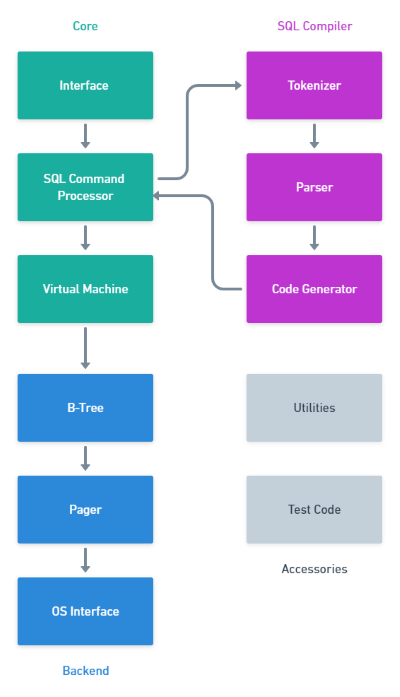

Rust SQLite
===

Read the series of posts about it:
[What would SQLite look like if written in Rust?](https://medium.com/the-polyglot-programmer/what-would-sqlite-would-look-like-if-written-in-rust-part-0-4fc192368984)

### Requirements
* `cargo install cargo-tarpaulin`

### Research
* https://github.com/mttr/rusql - A wannabe DBMS, in Rust
* https://github.com/kevinmehall/rust-peg - Parsing Expression Grammar (PEG) parser generator for Rust
* https://github.com/ballista-compute/sqlparser-rs - Extensible SQL Lexer and Parser for Rust
* https://crates.io/crates/sqlparser - 
