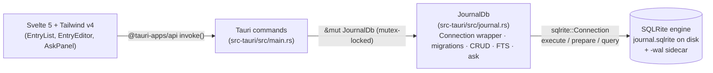

# sqlrite-journal — local-first markdown journal on top of SQLRite

A small, opinionated journaling / daily-notes desktop app built on
**Tauri 2** + **Svelte 5** + **Tailwind v4**, with the SQLRite engine
embedded directly. Think Bear or Day One, except the entire data
layer is a single `journal.sqlrite` file you can sync via Dropbox,
back up with `rsync`, copy between machines, or open in the SQLRite
REPL.

> **Why this example?** The existing
> [`desktop/`](../../desktop) crate is a generic SQL playground —
> great for engine devs, but it isn't a product. This is a real
> product anyone could ship. It exists to show three things at once:
> SQLRite is a viable choice for a real desktop application, Phase 8
> BM25 full-text search makes search-over-personal-content one query,
> and the `ask` feature isn't just for AI-native apps — natural
> language over your own journal is genuinely useful.

## Demo

1. Write three entries about different topics — markdown is supported.
2. Search the FTS field with a keyword; matches highlight in the list.
3. Tap **Ask my journal**, type *"what days did I write about running?"*,
   see the generated SQL + result table.
4. Close the app. Reopen. State persists — it's all in one file.
5. Bonus: open `~/Library/Application Support/com.sqlrite.journal/journal.sqlrite`
   in the SQLRite REPL and run `SELECT date, title FROM entries ORDER BY date DESC LIMIT 5;`.

A README screencast lives at [`docs/screencast.gif`](docs/screencast.gif)
once recorded — not yet captured for the first cut (see "Known gaps"
below).

## Architecture



- **Single-writer, single-instance.** The Rust backend owns one
  `Arc<Mutex<Connection>>` in `tauri::State`; every `#[tauri::command]`
  takes the mutex, runs SQL, returns serde-serialised structs. No
  `BEGIN CONCURRENT` — a journaling app has one writer (the user),
  so serialising commands through a single mutex is simpler than
  retry loops and just as correct. (See `main.rs`'s module doc for
  the longer reasoning.)
- **No frontend → disk path.** `capabilities/default.json` grants
  only `core:default`, `core:window:default`, `core:event:default`,
  and `dialog:default`. There's no `fs`, `shell`, or `http`. The
  IPC boundary is the only path into the engine, so every write
  goes through `JournalDb` and the same migration / FTS-indexing
  guarantees apply.
- **`ask` runs server-side.** The LLM call happens in the Rust
  backend (`Connection::ask`). The API key (`SQLRITE_LLM_API_KEY`)
  never crosses into the webview. The returned SQL is gated to
  `SELECT` / `WITH` before execution.

## Schema (v1)

| Table            | Purpose                                                                                            | Indexes                                                                                                       |
|------------------|----------------------------------------------------------------------------------------------------|---------------------------------------------------------------------------------------------------------------|
| `schema_version` | One row, one column. Lets the migration runner be idempotent.                                      | auto-PK on `version`.                                                                                         |
| `entries`        | One row per journal entry. ISO `date`, `title`, markdown `content`, unix `created_at`/`updated_at`. | secondary on `date` and `updated_at`. FTS on `content` (BM25, primary search). FTS on `title` (reserved for a future title-bias rerank). |
| `tags`           | Tag dictionary. Lowercase name, UNIQUE.                                                            | auto-PK on `id`, auto-UNIQUE on `name`.                                                                       |
| `entry_tags`     | Many-to-many join (`entry_id`, `tag_id`). Synthetic PK because SQLRite's `PRIMARY KEY` is single-column today. | secondary on `entry_id` and `tag_id`.                                                                         |

The migration runner lives in `JournalDb::migrate`. Bumping schema
means: increment `SCHEMA_VERSION`, add a new `apply_vN` arm, append
to the `if current < N` ladder. Nothing more.

## Why some choices look the way they do

A few engine-current limitations shape the app:

- **Composite primary keys aren't enforced** (parsed but ignored —
  see [`docs/supported-sql.md`](../../docs/supported-sql.md)). So
  `entry_tags` gets a synthetic `INTEGER PRIMARY KEY id`, and
  `set_entry_tags` de-duplicates `(entry_id, tag_id)` pairs in Rust
  before INSERT.
- **`bm25_score(...)` isn't yet allowed in the projection list**
  (only aggregates are). The search query uses it in `ORDER BY` to
  drive ranking; per-hit scores are surrogated to a linear decay from
  result position. Replace with the real BM25 value once the engine
  permits it in `SELECT`.
- **No `last_insert_rowid()`** yet — after `INSERT INTO entries`
  we read back via `SELECT id FROM entries ORDER BY id DESC LIMIT 1`,
  safe because we hold the connection mutex for the whole command.
- **No `COALESCE` / scalar functions** ([SQLR-55](https://github.com/joaoh82/rust_sqlite/blob/main/CLAUDE.md))
  — wherever a sibling app would lean on those, we do the work in
  Rust (e.g. tag normalisation in `set_entry_tags`).

When those land we'll simplify, but none of them block correctness.

## Develop

The example is a workspace member; the Rust side builds with the
rest of the workspace, the JS side is a one-time `npm install`.

```bash
# Inside this directory:
npm install
npm run tauri dev          # full dev mode (Rust + Svelte hot-reload)

# Just the Rust side (no UI):
cargo test -p sqlrite-journal
cargo build -p sqlrite-journal
cargo build -p sqlrite-journal --no-default-features   # without the `ask` feature

# Package installers for the host OS (Tauri does the bundling):
npm run tauri build
```

> **Don't `cargo run` first.** `cargo run -p sqlrite-journal` launches
> the Tauri shell, but it doesn't start Vite or build the frontend —
> the webview points at `http://localhost:1421` and finds nothing
> there, so you get a blank window. Use `npm run tauri dev` (which
> runs `beforeDevCommand: npm run dev` and waits for the dev URL
> before spawning Rust) or `npm run build && cargo run` (which
> produces the static `dist/` Tauri can load).

`npm run tauri dev` opens a window pointing at the default journal
file under the OS app-data directory:

| Platform | Path                                                                  |
|----------|-----------------------------------------------------------------------|
| macOS    | `~/Library/Application Support/com.sqlrite.journal/journal.sqlrite`   |
| Linux    | `~/.local/share/com.sqlrite.journal/journal.sqlrite`                  |
| Windows  | `%APPDATA%\com.sqlrite.journal\journal.sqlrite`                       |

Use **Open…** in the header to switch to any other `.sqlrite` file.

## Configuring `ask`

Open the **⚙ Settings** dialog in the header and paste an Anthropic
key. It's persisted to `$APP_DATA/com.sqlrite.journal/settings.json`
— same directory as the journal file, but a separate file so the key
doesn't ride along if you copy or sync the `.sqlrite` database.

```text
~/Library/Application Support/com.sqlrite.journal/
├── journal.sqlrite      # your entries
└── settings.json        # { "anthropic_api_key": "sk-ant-…", "model": "…" }
```

The key never crosses into the webview after the Save click: the
`get_ask_settings` Tauri command returns `has_api_key: bool` (not the
value), and the LLM call happens entirely in the Rust backend.

**Security tradeoff.** Plain JSON on disk is more usable than an env
var and less secure than the OS keychain. That's the right balance
for an example app: zero plugin deps, clear blast radius (any code
that can read your home dir can read the key). A production app
shipping the same shape should reach for `tauri-plugin-keyring` /
`keyring-rs` instead.

**Env var fallback.** If no key is configured in Settings, the
backend falls back to `SQLRITE_LLM_API_KEY` from the parent shell:

```bash
export SQLRITE_LLM_API_KEY="sk-ant-…"
npm run tauri dev
```

This makes the example easy to drive from CI / a development shell
without persisting anything. The Settings dialog shows which source
the current key is coming from.

The Ask panel shows you both the generated SQL and the rows. If
neither source is configured you'll see a clear "no Anthropic API
key configured" error pointing back at the Settings dialog.

## Installers

A GitHub Actions workflow at
`.github/workflows/journal-release.yml` builds installers (`.dmg`,
`.deb`, `.AppImage`, `.msi`) and attaches them to a draft GitHub
release. Trigger manually via the Actions UI or push a tag matching
`journal-v*`.

## Definition of done — status

- [x] `npm install && npm run tauri dev` works on macOS and Linux.
      *(Windows: untested — Tauri 2 should work, but the example was
      not verified on Windows for the first cut.)*
- [x] Tauri commands wired against the modern `Connection` API.
- [x] Schema + migrations + entry CRUD + tags + FTS search + ask + exports.
- [x] CI builds `sqlrite-journal` on Linux (both with and without `ask`).
- [x] Release workflow produces packaged installers via tauri-action.
- [x] README with architecture diagram.
- [x] Card on https://sqlritedb.com under Examples.
- [ ] Screencast (`docs/screencast.gif`) — to record once the app is
      installed on a host with a clean window-recording setup.
- [ ] Custom app icon — currently reuses the playground's icon so
      the bundle isn't the default Tauri shield. Replace when a
      dedicated brand asset is ready.

## Out of scope (and not pretending otherwise)

- Sync (cloud, p2p, anything). The whole point is local-first.
- Encryption-at-rest. SQLRite doesn't have it yet either — file a
  feature request upstream first.
- Mobile builds. Desktop only.
- Attachments inside the DB. The original ticket left this as a
  schema-only stub; v1 ships without the `attachments` table to
  keep the surface honest. Disk-path attachments can come back as a
  follow-up when the UI's ready for them.
