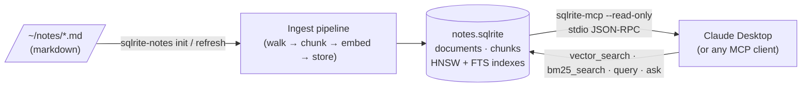

# sqlrite-notes — chat with your markdown notes via Claude Desktop

A Node.js CLI that ingests a folder of markdown notes (Obsidian
vault, Notion export, plain `~/Documents/notes`) into a SQLRite
database, then exposes the database to **Claude Desktop / any MCP
client** through the engine's first-party MCP server.

End-user effect: drop your notes folder in, paste one block into
Claude Desktop's config, and ask Claude *"what did I write about
CRDTs last month?"* — it answers using your local notes. No cloud
sync, no third-party indexer, the entire memory is one `.sqlrite`
file on disk you can open in the REPL.

> **Why this example?** Other "chat with your notes" demos build a
> custom RAG pipeline and bolt it onto a model. This one shows that
> when the database itself speaks the agent protocol, you don't need
> a pipeline — *Claude drives the database directly* via
> `sqlrite-mcp`. The Node.js side is just the ingest + glue.

## Architecture



The whole stack: Node.js for the **write side** (ingest pipeline,
chunking, embeddings), SQLRite for **storage + retrieval primitives**
(HNSW vector index, BM25 inverted index, raw SQL), and `sqlrite-mcp`
for the **read side** that Claude actually talks to. The Node CLI
never touches the database while Claude is connected — that's what
`--read-only` is for.

## Schema (v1)

| Table       | Purpose                                                                                        | Indexes                                                              |
|-------------|------------------------------------------------------------------------------------------------|----------------------------------------------------------------------|
| `documents` | One row per `.md` file — path, title, mtime, full body, content hash.                          | UNIQUE on `path`. FTS on `content` (BM25 over whole docs).           |
| `chunks`    | One row per ~400-token slice of a document, plus a `VECTOR(384)` embedding.                    | HNSW on `embedding` (semantic KNN). FTS on `content` (passage BM25). |

Hybrid retrieval queries `chunks` and fuses BM25 + vector cosine in a
single `ORDER BY` (see [`docs/fts.md`](../../docs/fts.md) for the
SQL pattern; the executor's `try_fts_probe` hook serves the top-k
straight from the inverted index).

## Install

```bash
npx sqlrite-notes init ~/Documents/notes
```

That's it for the Node side — `npx` downloads `sqlrite-notes`, which
pulls **`@joaoh82/sqlrite`** with prebuilt napi-rs binaries for
macOS-arm64, Linux x64/arm64, and Windows x64. No clone, no
`npm install`, no Rust toolchain required.

`sqlrite-mcp` is a separate Rust binary used by the `serve`
subcommand. Install it once, anywhere on your `PATH`:

```bash
# from crates.io (~30s):
cargo install sqlrite-mcp

# or grab a prebuilt binary from GitHub Releases:
# https://github.com/joaoh82/rust_sqlite/releases
```

If you don't want to install globally, set `SQLRITE_MCP_BIN` to its
absolute path — `sqlrite-notes serve` will pick it up.

## Run

```bash
# 1. Ingest a folder of markdown into a notes.sqlrite database.
npx sqlrite-notes init ~/Documents/notes

# 2. Confirm it works locally — same retrieval shape Claude will see.
npx sqlrite-notes search "what did I learn about CRDTs?"

# 3. Wire up Claude Desktop using the snippet printed by `init`
#    (also available any time via `npx sqlrite-notes config`).

# 4. Open Claude Desktop. The sqlrite-mcp tools appear in the
#    tool picker — `bm25_search`, `vector_search`, `query`, `ask`,
#    plus `list_tables` / `describe_table` / `schema_dump`.
```

> **Pinning a version.** `npx sqlrite-notes` pulls the latest; pass
> `npx sqlrite-notes@0.10.1 …` (or whichever tag) to lock to a
> specific release. The package ships in lockstep with the SQLRite
> engine, so the version number matches `@joaoh82/sqlrite`'s.

Once you've added the snippet to `claude_desktop_config.json` and
restarted Claude Desktop, run a chat like:

> *"Summarize what I've written about Postgres over the last month."*

Claude will call `bm25_search` (and/or `vector_search`) against the
`chunks` table, get back the matching passages, and answer with
inline citations to the file path and chunk number.

## Zero-config: works fully offline

The default embedder is a **deterministic hash-based bag-of-words**
embedder that runs in pure JavaScript. No API key, no network,
nothing to install — `sqlrite-notes init ~/Documents/notes` works
on a fresh laptop.

Hybrid retrieval still beats either signal alone because BM25 is
already doing exact-term ranking; the hash embedder mostly carries
its weight via the long-tail of co-occurring tokens.

For real semantic recall, switch to OpenAI:

```bash
export OPENAI_API_KEY=sk-...
node bin/sqlrite-notes.mjs init ~/Documents/notes --embedder openai
```

Uses `text-embedding-3-small` with the `dimensions: 384` override
so it matches the schema. Override the model with
`--openai-model text-embedding-3-large` (and bump `--dim` if you
want full-fat dimensionality).

## CLI surface

```
sqlrite-notes init <dir>        Ingest <dir> into the notes DB (replaces the index).
sqlrite-notes refresh <dir>     Re-ingest only files whose mtime/hash changed.
sqlrite-notes search "<query>"  Hybrid retrieval against the index (debug).
sqlrite-notes serve             Spawn sqlrite-mcp --read-only against the DB.
sqlrite-notes stats             Row counts.
sqlrite-notes config            Print the Claude Desktop config snippet again.
```

Common flags:

```
--db <path>             Path to the SQLRite database file. Default: ~/.sqlrite-notes/notes.sqlrite
--embedder hash|openai  Embedding provider. Default: hash (offline).
--dim <N>               Vector dimension. Default: 384.
--openai-model <name>   OpenAI embedding model. Default: text-embedding-3-small.
--chunk-tokens <N>      Target chunk size in tokens. Default: 400.
--chunk-overlap <N>     Chunk overlap in tokens. Default: 60.
```

## Claude Desktop config

`sqlrite-notes init` prints this block; you can also regenerate it
any time with `sqlrite-notes config --db <path>`:

```json
{
  "mcpServers": {
    "sqlrite-notes": {
      "command": "sqlrite-notes",
      "args": ["serve", "--db", "/Users/you/.sqlrite-notes/notes.sqlrite"]
    }
  }
}
```

Where it lives:

| Platform | Path |
|---|---|
| macOS    | `~/Library/Application Support/Claude/claude_desktop_config.json` |
| Linux    | `${XDG_CONFIG_HOME:-~/.config}/Claude/claude_desktop_config.json` |
| Windows  | `%APPDATA%\Claude\claude_desktop_config.json` |

Merge the snippet into any existing `mcpServers` block; don't
overwrite the file wholesale.

### Try it without Claude Desktop

If you don't have Claude Desktop, the same MCP server works with
**any** MCP client — Cursor, Codex, your own. The fastest way to
verify the wiring is Anthropic's inspector:

```bash
npx @modelcontextprotocol/inspector sqlrite-notes serve --db ./notes.sqlrite
```

Open the URL it prints, click through the tools, type JSON args.
Saves a lot of "did Claude restart correctly?" debugging.

## Open the DB yourself

The notes index is plain SQLRite — open it in the REPL whenever:

```bash
$ cargo install sqlrite-engine     # or grab a release binary
$ sqlrite ./notes.sqlrite
SQLRite v0.10.0
sqlrite> SELECT path, title FROM documents ORDER BY mtime DESC LIMIT 5;
sqlrite> SELECT path, ord, substr(content, 1, 80)
   ...>   FROM chunks
   ...>   JOIN documents ON chunks.document_id = documents.id
   ...>  WHERE fts_match(chunks.content, 'rust embedded')
   ...>  ORDER BY bm25_score(chunks.content, 'rust embedded') DESC
   ...>  LIMIT 5;
```

This is the demo's whole point: **the notes index is just SQL**. You
can query it, back it up, copy it between machines, or feed the same
file into the Python / Go / WASM SDKs without converting anything.

## How hybrid retrieval works

The `search` command (and Claude, indirectly, when it composes
`query` calls) runs the canonical hybrid shape from
[`docs/fts.md`](../../docs/fts.md):

```sql
SELECT id, document_id, ord, content FROM chunks
 WHERE fts_match(content, 'collaborative editing CRDT')
 ORDER BY 0.5 * bm25_score(content, 'collaborative editing CRDT')
        + 0.5 * (1.0 - vec_distance_cosine(embedding, [/* query embedding */]))
DESC LIMIT 5;
```

Two things worth noting:

1. `vec_distance_cosine` returns a *distance* (`1 - cos(a, b)`).
   Hybrid scoring wants "higher is better", so we invert it.
2. `fts_match` pre-filters before scoring. Paraphrases with zero
   shared tokens never get scored — a deliberate tradeoff. If a
   query produces no FTS tokens at all (e.g. a single non-ASCII
   word), `db.hybridSearch()` falls back to vector-only so Claude
   always has *something* to ground on.

The `-w 0..1` flag on `sqlrite-notes search` tunes the BM25 / vector
balance. At `-w 1` you get pure BM25; at `-w 0` pure vector cosine.
Default is 0.5.

## Known limitations

- **Concurrent `refresh` while `serve` is running.** SQLRite shipped
  `BEGIN CONCURRENT` writes in v0.10 (the SQLR-22 / Phase 11 work),
  so reading from `sqlrite-mcp --read-only` while `sqlrite-notes
  refresh` writes is supported in principle. *In practice we
  recommend stopping Claude Desktop's MCP connection during a
  refresh* — Claude Desktop caches the tool schemas at server-spawn
  time and won't notice newly-ingested files until you reload it
  anyway, so the gain from coexisting isn't worth the surprise.

- **Aggregates limited.** The engine supports `COUNT(*)`,
  `SUM`/`AVG`/`MIN`/`MAX` but not arbitrary expressions in `SELECT`
  projection beyond aggregates (see [`docs/supported-sql.md`](../../docs/supported-sql.md)).
  The `stats` command sticks to `COUNT(*)`.

- **No parameter binding yet.** Engine SDKs don't yet accept `?`
  placeholders ([Phase 5a.2](../../docs/roadmap.md) follow-up); all
  SQL strings inline literals via the `q()` helper in
  [`src/sqlutil.mjs`](src/sqlutil.mjs). That helper handles
  quoting + vector-literal encoding for the four value types we use
  (string / int / vector / null).

- **Re-ingest persistence.** `refresh` requires you to pass the
  source directory again (we don't yet store it inside the DB). If
  you forget the path, run `sqlrite-notes stats --db <path>` to
  confirm the index exists, then re-run `init` to rebuild from
  scratch — it's idempotent.

- **`--watch` mode** — not in v1. Re-run `refresh` manually after
  adding notes.

- **Authentication.** None. This is a single-user local tool; the
  MCP server inherits the spawner's filesystem privileges. Don't
  point it at a database you wouldn't share with whoever can read
  your home directory.

## Development

Hacking on the example itself — running tests, editing the CLI,
iterating against a local engine binding — uses the clone path:

```bash
git clone https://github.com/joaoh82/rust_sqlite
cd rust_sqlite/examples/nodejs-notes
npm install
npm test           # offline; runs all 40 unit + integration tests
# Iterate against the local sources:
node bin/sqlrite-notes.mjs init ~/Documents/notes
```

The test suite uses `node:test` and exercises:

- `chunker` (frontmatter, title derivation, overlap windowing)
- `sqlutil` (every value type the engine accepts as a SQL literal)
- `embeddings` (hash determinism + a mocked OpenAI HTTP call)
- `db` (schema migration, upsert/delete/cascade, hybrid retrieval)
- `ingest` (end-to-end against the markdown fixtures in
  [`test/fixtures/`](test/fixtures/))
- `serve` + `claude-config` (binary lookup, snippet shape)

A few tests need the `@joaoh82/sqlrite` engine binding installed;
they skip cleanly (with a message) if it isn't.

## Layout

```
examples/nodejs-notes/
├── package.json                       # @joaoh82/sqlrite pinned in lockstep with the engine release
├── README.md                          # this file
├── bin/
│   └── sqlrite-notes.mjs              # entry — calls src/cli.mjs
├── src/
│   ├── cli.mjs                        # argv parsing + command dispatch
│   ├── config.mjs                     # defaults + path resolution
│   ├── sqlutil.mjs                    # q() + ident() — SQL literal helpers
│   ├── db.mjs                         # schema, migrations, every SQL string
│   ├── chunker.mjs                    # frontmatter + heading-aware chunking
│   ├── embeddings.mjs                 # hash + OpenAI embedders
│   ├── ingest.mjs                     # plan → delete → insert
│   ├── search.mjs                     # hybrid retrieval driver
│   ├── serve.mjs                      # spawn sqlrite-mcp --read-only
│   └── claude-config.mjs              # Claude Desktop snippet renderer
└── test/                              # node --test suite
    ├── fixtures/                      # 3 short markdown notes
    ├── chunker.test.mjs
    ├── claude-config.test.mjs
    ├── db.test.mjs                    # integration — needs @joaoh82/sqlrite
    ├── embeddings.test.mjs
    ├── ingest.test.mjs                # integration — needs @joaoh82/sqlrite
    ├── serve.test.mjs
    └── sqlutil.test.mjs
```

The example binds only to the documented public surfaces:
[`@joaoh82/sqlrite`](../../sdk/nodejs/) (`Database`, `Statement`)
and [`sqlrite-mcp`](../../docs/mcp.md) as a child process. It does
not reach into engine internals.

## License

MIT — same as the rest of the rust_sqlite repo.
