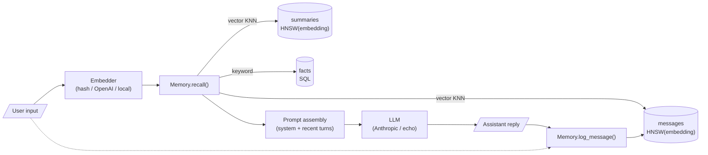

# sqlrite-agent — a Python LLM agent with persistent memory in SQLRite

A small CLI chat agent whose entire long-term memory lives in **one
`.sqlrite` file on disk**. Every turn the agent:

1. Embeds the user's message.
2. Hybrid-searches its memory: top-k vector KNN (HNSW) over past
   messages and summaries, plus keyword recall over the structured
   `facts` table.
3. Injects the recalled context into the system prompt.
4. Sends prompt + recent turns to an LLM and prints the reply.
5. Writes the new turn back to the same SQLRite database.

Close the process, reopen it days later — your assistant still knows
your dog's name. No Postgres, no Pinecone, no Redis. One file.

> **Why this example?** Single-file embedded storage is the *right*
> architecture for a local agent, and SQLRite's HNSW vector index +
> structured SQL gives you semantic *and* deterministic recall from one
> store. This is a place where the database genuinely fits the
> workload, not just a demo.

## Architecture



Three tables, one file:

| Table       | Purpose                                                     | Indexed how                              |
|-------------|-------------------------------------------------------------|------------------------------------------|
| `messages`  | Every user / assistant turn, plus its 384-dim embedding.    | HNSW on `embedding`                      |
| `summaries` | Periodic rollups for old context that's too long to inline. | HNSW on `embedding`                      |
| `facts`     | Structured `(subject, predicate, object)` triples extracted from user turns. | Plain SQL — keyword recall  |

## Install

```bash
# 1. Clone the rust_sqlite repo (this example ships inside it).
git clone https://github.com/joaoh82/rust_sqlite
cd rust_sqlite/examples/python-agent

# 2. Create a virtualenv and install the example.
python3 -m venv .venv && source .venv/bin/activate
pip install -e .

# 3. (Optional) Install an LLM provider extra. Without one you get
#    the offline "echo" agent — the recall pipeline still runs.
pip install 'sqlrite-agent[anthropic]'         # default LLM
# pip install 'sqlrite-agent[openai]'           # use OpenAI embeddings too
# pip install 'sqlrite-agent[local-embeddings]' # 384-dim sentence-transformer
```

The `sqlrite` Python wheel comes from PyPI automatically (pinned to the
0.10.x release that introduced `VECTOR(N)` + HNSW indexes).

## Run

```bash
# Zero config — runs against a fresh in-memory hash embedder and the
# offline echo "LLM". You see the recall pipeline work end-to-end
# without an API key.
python -m sqlrite_agent

# With Anthropic — set ANTHROPIC_API_KEY and run.
export ANTHROPIC_API_KEY=sk-ant-...
python -m sqlrite_agent

# Pick where the DB lives (default: ~/.sqlrite-agent.sqlrite).
python -m sqlrite_agent --db ./my-agent.sqlrite

# Multiple parallel conversations in one DB.
python -m sqlrite_agent --conversation work
python -m sqlrite_agent --conversation personal

# Force a specific embedder.
python -m sqlrite_agent --embedder local       # sentence-transformers
python -m sqlrite_agent --embedder openai      # text-embedding-3-small
```

## CLI commands

While the REPL is running, anything starting with `/` is a command:

| Command            | What it does                                                   |
|--------------------|----------------------------------------------------------------|
| `/help`            | Show all commands.                                             |
| `/stats`           | Counts of messages, summaries, facts.                          |
| `/facts`           | List every extracted fact.                                     |
| `/recent`          | Last 10 turns in chronological order.                          |
| `/recall <query>`  | Show what *would* be recalled for a query, without replying.   |
| `/summarize`       | Summarize the last 20 turns into a single `summaries` row.     |
| `/quit`            | Exit. `Ctrl-D` also works.                                     |

## 60-second demo script

Run this top-to-bottom to see persistent memory survive a process
restart. Uses the zero-key default (`hash` embedder + `echo` chat).

```bash
# Session 1 — drop some facts, then quit.
$ python -m sqlrite_agent --db agent.sqlrite
sqlrite-agent 0.1.0 — db=agent.sqlrite, ...
  loaded memory: 0 messages, 0 summaries, 0 facts.

you> My dog's name is Mochi.
agent> [echo agent ...]

you> Mochi loves carrots more than treats.
agent> [echo agent ...]

you> I live in Lisbon, Portugal.
agent> [echo agent ...]

you> /facts
  user.dog.name = Mochi
  user.location = Lisbon, Portugal

you> /quit

# Session 2 — fresh process, same DB.
$ python -m sqlrite_agent --db agent.sqlrite
sqlrite-agent 0.1.0 — db=agent.sqlrite, ...
  loaded memory: 6 messages, 0 summaries, 2 facts.

you> What's my dog's name?
  [recalled: 1 facts, 0 summaries, 4 messages]
agent> [echo agent ... — but the recall block above includes
                          user.dog.name = Mochi]
```

With `ANTHROPIC_API_KEY` set, the second turn answers "Mochi" instead
of the canned echo because the LLM sees the recalled fact in its
system prompt.

## Open the DB yourself with the SQLRite REPL

The memory file is plain SQLRite — open it from anywhere:

```bash
$ cargo install sqlrite-engine   # or grab a binary from GitHub Releases
$ sqlrite agent.sqlrite
SQLRite v0.10.0
sqlrite> SELECT role, content FROM messages ORDER BY id LIMIT 5;
sqlrite> SELECT subject, predicate, object FROM facts;
sqlrite> SELECT id, content
   ...>   FROM messages
   ...>   ORDER BY vec_distance_cosine(embedding, (SELECT embedding FROM messages WHERE id = 1))
   ...>   LIMIT 3;
```

This is the demo's whole point: **the agent's memory is just SQL**.
You can query it, back it up, copy it between machines, or load it
into the Node / Go / WASM SDK without converting anything.

## How recall works

`Memory.recall(query)` runs three searches in parallel and merges the
results. Pseudocode:

```python
embedding = embedder.embed(query)
keywords  = query_keywords(query)        # filtered to content words

vector_messages   = SELECT ... FROM messages
                     ORDER BY vec_distance_cosine(embedding, ?)
                     LIMIT k_messages

vector_summaries  = SELECT ... FROM summaries
                     ORDER BY vec_distance_cosine(embedding, ?)
                     LIMIT k_summaries

lexical_messages  = SELECT ... FROM messages
                     WHERE fts_match(content, ?)
                     ORDER BY bm25_score(content, ?) DESC
                     LIMIT k_messages           -- Phase 8, BM25 over the inverted index

facts             = SELECT * FROM facts
                     WHERE subject LIKE ...
                        OR predicate LIKE ...
                        OR object LIKE ...
                     LIMIT k_facts
```

The vector and lexical message lists are merged in Python (dedupe by
`id`, vector ranking primary) — that's the simplest correct shape for
hybrid retrieval: vector finds conceptual neighbors even with zero
lexical overlap, and BM25 surfaces exact-term matches the vector
embedding might rank too low. See [`docs/fts.md`](../../docs/fts.md)
for the BM25 surface and [`examples/hybrid-retrieval/`](../hybrid-retrieval/)
for an example that fuses both into a single `ORDER BY` arithmetic.

## Embedding-provider tradeoffs

| Provider       | Dependencies          | API key | Real semantic recall | First-run friction |
|----------------|-----------------------|---------|----------------------|--------------------|
| `hash` (default) | None — stdlib only  | No      | Bag-of-words approximation only. Good enough for the demo, mediocre for real RAG. | Zero. |
| `openai`       | `openai` package      | `OPENAI_API_KEY` | Excellent. `text-embedding-3-small` constrained to 384 dims. | ~30s install. |
| `local`        | `sentence-transformers` (~500 MB with torch) | No | Excellent. `all-MiniLM-L6-v2`, fully offline. | ~5 min install. |

Swap with `--embedder hash | openai | local`. The dimension is fixed
at 384 to match `VECTOR(384)` in the schema; if you need a different
dim, change `DEFAULT_DIM` in `sqlrite_agent/db.py` and start with a
fresh DB.

## Known simplifications

This is an *example*, not a production agent. Things v1 punts on:

- **Memory eviction.** No automatic rolling-window or summarize-and-evict
  loop yet — run `/summarize` manually when the conversation grows
  unwieldy.
- **Fact extraction.** Six hand-written regex patterns. A real agent
  would call the LLM to extract facts so it catches phrasings the
  regex misses. Easy upgrade: wrap an LLM call in `facts.extract_facts`.
- **Single-query hybrid.** The agent merges vector hits and BM25 hits
  in Python. The engine also supports a single SQL query that fuses
  both into one `ORDER BY` arithmetic (`0.5 * bm25_score(...) + 0.5 *
  (1.0 - vec_distance_cosine(...))`) — see [`examples/hybrid-retrieval/`](../hybrid-retrieval/).
  The merge approach handles conceptual queries with no token overlap;
  the single-query approach is tighter when you always want BM25 to
  pre-filter. Pick per workload.
- **Concurrency.** The agent assumes single-user single-process. The
  engine supports concurrent reads + a single writer via fs2 advisory
  locks; running two `sqlrite-agent` processes against the same DB
  works, but they won't see each other's in-flight writes until commit.

## Development

```bash
# Tests run fully offline with the hash embedder and echo chat — no
# API keys, no network.
pip install -e '.[dev]'
pytest
```

## Layout

```
examples/python-agent/
├── pyproject.toml             # package metadata + pinned sqlrite dep
├── README.md                  # this file
├── sqlrite_agent/
│   ├── __init__.py
│   ├── __main__.py            # python -m sqlrite_agent → cli.main()
│   ├── agent.py               # turn loop, prompt assembly, summarization
│   ├── chat.py                # LLM provider abstraction (Anthropic / Echo)
│   ├── cli.py                 # interactive REPL + slash commands
│   ├── db.py                  # schema, migrations, all SQL
│   ├── embeddings.py          # Embedder abstraction (hash / OpenAI / local)
│   ├── facts.py               # regex-based fact extractor
│   ├── memory.py              # hybrid recall over messages + summaries + facts
│   └── sqlutil.py             # safe SQL-literal inlining
└── tests/                     # offline pytest suite (31 tests)
```

The agent binds only to the SQLRite Python SDK's documented public
surface (`sqlrite.connect`, `Connection`, `Cursor`). It does not reach
into internals.

## License

MIT — same as the rest of the rust_sqlite repo.
